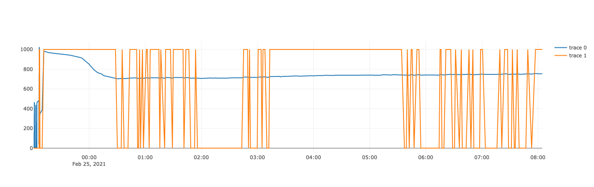

# Quick and Dirty Monitor for Offerzen Make Day Smart Plant

Keep track of what your smart plant is up to while you're not watching.

## What is it?

Have your ESP8266 send updates to a simple python Flask web app that will serve you a graph that looks like this!



Apologies for the poor labels (TODO: fix graph labels). trace0 is the analog moisture reading and trace 1 is the digital pump on/off. As you can see my smart plant was up to something weird last night trying to drown itself even though it had run out of water. Fortunately the pump only runs for a few ms every minutes so it didn't burn out :D

## Background

Quickly hacked this together after building a self watering plant with Offerzen's Make day https://github.com/OfferZen-Make/plant_tech_ams

## Instructions

### Run the server locally

Assuming you have python installed (TODO: add instructions)

```
pip install -r requirements.txt
python app.py
```
Then go check out a blank plot at `http://localhost:5000`

### Test it out

With your server running locally on port `5000` (the default), run in a terminal

```
curl --header "Content-Type: application/json" \
  --request POST \
  --data '{"analogData": 834, "pumpOn": false}' \
  http://localhost:5000/record
```
Maybe do it a few times. Then go reload your page at `http://localhost:5000`

### Host on Heroku

TODO: add proper instructions

In the meantime, follow this https://devcenter.heroku.com/articles/getting-started-with-python except clone this repo instead of their one

### Get your smart plant to send you updates

Upload the sketch at `esp8266/smart_plant` (add in your ssid and password first). You also need to add the URL for your web app (whatever it is called on heroku). This is just an evolution of the sketches that are in the Make repo linked above so get those working first.

The watering approach in the sketch is to just give a few drops every sleep/wake cycle and decides whether to pump based on the digital moisture reading. The level this is set at will depend on what you have set your moisture reading sensor to. I'm sure you can think of many ways to improve this.

The sketch also assumes you've changed the wiring to allow it to only turn on the moisture sensor when it wants to take a reading. @SamLoys describes it at the bottom of this page https://github.com/OfferZen-Make/plant_tech_ams/blob/master/examples/DeepSleepDataLogger/README.md

## Limitations

HA! Lots. Pretty much everything. Here are some highlights

- The data store is just in memory so everything is lost whenever the process that runs your server restarts
- The plot just shows you everything and you have no control over that
- You have to send exactly the data that the server is expecting otherwise it won't know what to do with it (have a look at the sketch in 
`sdp8266/smart_plant` to see what it sends)
- Apologies for the dodgy python. I'm new.

## Other stuff to check out

There is a whole list on https://github.com/OfferZen-Make/plant_tech_ams#community-project-repos but https://github.com/OfferZen-Make/plant_tech_ams/tree/master/examples/DeepSleepDataLogger is a probably an easier way to get started saving your readings and drawing graphs (to a google sheet)